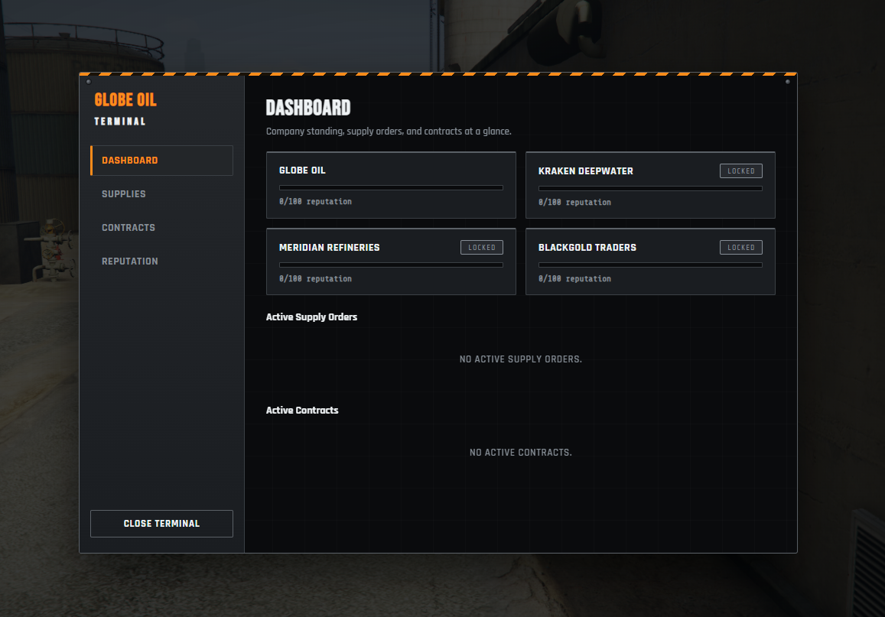
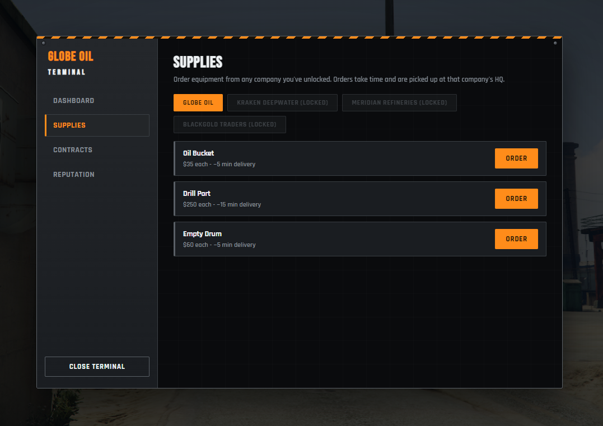
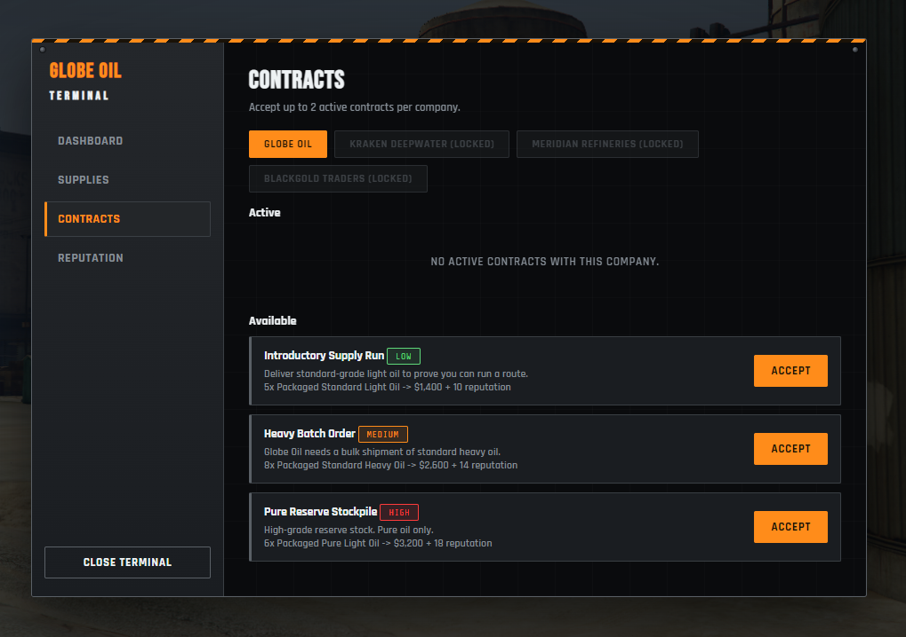
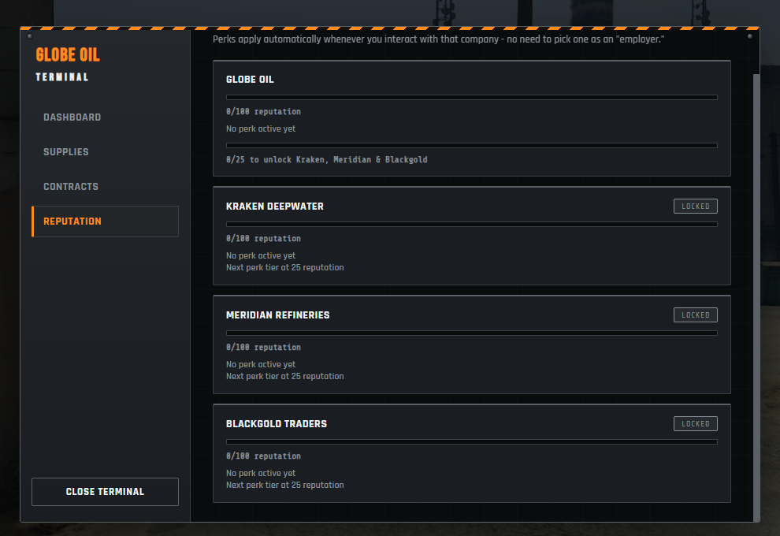
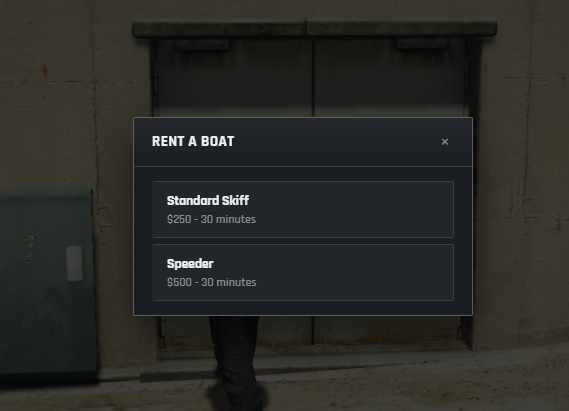
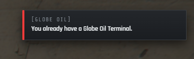

<div align="center">


# Fiji Oil — V2.0.0

**A complete offshore oil operation for FiveM.**
Drill crude at sea, refine and package it on land, then sell or contract it out to one of four companies — each with its own reputation track and perks. Every screen is a custom-built, sleek industrial UI. **No ox_lib UI anywhere in this script.**


</div>

---

## Table of Contents

- [Features](#features)
- [Preview](#preview)
- [Compatibility](#compatibility)
- [Dependencies](#dependencies)
- [Installation](#installation)
- [The Loop](#the-loop)
- [Companies](#companies)
- [The Terminal](#the-terminal)
- [Items](#items)
- [Commands](#commands)
- [Credits](#credits)
- [Version History](#version-history)

---

## Features

- 🛢️ **Offshore drilling** — rent a boat, sail out to a rig, and drill for light or heavy crude
- 🚤 **Boat rentals** — multiple tiers, timed, with a partial refund for early returns
- 📟 **The Globe Oil Terminal** — a single handheld device for everything: supplies, contracts, and reputation
- 📦 **Supply orders** — order buckets, drill parts, and drums; they take real time to arrive and are picked up at whichever unlocked HQ you choose
- 🏢 **Four companies, four personalities** — Globe Oil (neutral base), Kraken Deepwater (drilling), Meridian Refineries (refining), Blackgold Traders (commerce), each with independent, stacking reputation and perks
- 📋 **Contracts** — a repeatable job board per company, worked entirely through the Terminal, paying cash + reputation
- ⚗️ **Full refining chain** — hopper, distillation, and extraction, producing pure/standard/dirty grades with a chance of byproducts
- 🛢️ **Packaging** — convert refined oil into sellable drums; unpackaged refined oil is left alone as a plain item, ready for a future crafting system to consume
- 🎛️ **Sleek industrial custom UI** — toasts, progress bars, text prompts, context menus, input dialogs, circular countdowns, and the full 4-tab Terminal app, all hand-built (no ox_lib UI, no ox_lib dependency at all)
- 🔌 **Every framework, every inventory, every target system** — QBCore, QBX Core, and ESX; ox_inventory, qb-inventory, qs-inventory, and ESX's built-in inventory; ox_target, qb-target, qtarget, or proximity interactions with zero target resource installed
- 💾 **Persistent** — reputation, contracts, and supply orders survive restarts (oxmysql-backed)

## Preview

<table>
  <tr>
    <td align="center"><br/><sub><b>Dashboard</b></sub></td>
    <td align="center"><br/><sub><b>Supplies</b></sub></td>
    <td align="center"><br/><sub><b>Contracts</b></sub></td>
  </tr>
  <tr>
    <td align="center"><br/><sub><b>Reputation</b></sub></td>
    <td align="center"><br/><sub><b>Boat Rental</b></sub></td>
    <td align="center"><br/><sub><b>Custom Notifications</b></sub></td>
  </tr>
</table>

## Compatibility

Detected automatically at resource start, independently for each concern:

| Concern | Supported |
|---|---|
| **Framework** (money, identifiers) | QBCore, QBX Core, ESX |
| **Inventory** (items) | ox_inventory, qb-inventory, qs-inventory, ESX's built-in inventory |
| **Target** (interactions) | ox_target, qb-target, qtarget, or proximity + on-screen prompt if none are installed |

## Dependencies

- [oxmysql](https://github.com/overextended/oxmysql) — required, stores reputation, contracts, and supply orders
- One of the inventory systems listed above
- Optionally one of the target systems listed above (falls back to proximity interactions otherwise)

## Installation

1. Install oxmysql if you don't already have it.
2. Import `sql/fiji_oil.sql` into your database (the resource will also try to create these tables itself on first start as a safety net, but importing manually first is recommended).
3. Add the items listed below to your inventory system.
4. Drop this resource into your `resources` folder and add `ensure fiji-oil` to your `server.cfg`.
5. Open `shared/config.lua` and adjust locations, prices, contracts, and perk tiers to fit your server. Every location in the default config is a placeholder — retune it to your map.

> [!IMPORTANT]
> Every coordinate shipped in `shared/config.lua` is a placeholder (Elysian Island / Terminal area + open ocean south of Los Santos). Retune every HQ, rig, marina, refinery, and packaging location before going live.

## The Loop

1. **Get a Terminal.** Visit Globe Oil HQ and register at the kiosk to receive a Globe Oil Terminal (`globe_oil_terminal`). Use the item any time to open it.
2. **Order supplies.** From the Terminal's Supplies tab, order oil buckets, drill parts, and empty drums from any company you've unlocked. Orders take real time and are picked up at the HQ you chose as drop-off.
3. **Rent a boat** at the Globe Oil Marina and head out to one of the offshore rigs.
4. **Drill** for crude oil (light or heavy, weighted random) — each unit consumes one oil bucket and some of a drill part's charges.
5. **Refine** at the Globe Oil refinery: load the hopper, distill, then extract. Yields pure/standard/dirty grades with a chance of byproducts.
6. **Package** the refined oil into drums.
7. **Sell** packaged oil directly at any unlocked company's trade desk, or **fulfill a contract** through the Terminal for a bigger payout and reputation.

## Companies

| Company | Role | Perk |
|---|---|---|
| **Globe Oil** | The neutral base company. Always unlocked, no perk bias. | Reach 25% reputation with them to unlock the other three. |
| **Kraken Deepwater** | Drilling specialists. | Faster drilling, chance of bonus crude per unit. |
| **Meridian Refineries** | Refining specialists. | Faster refining, better odds of "pure" grade. |
| **Blackgold Traders** | Commerce specialists. | Better sell prices, bigger contract reputation payouts. |

Perks apply per-company and contextually — there's no need to pick one company as your "employer." Selling to Blackgold gets Blackgold's price perk regardless of your standing elsewhere. Reputation is earned by fulfilling that company's contracts (large gain) and by selling to them directly (small gain per unit).

## The Terminal

One custom NUI app, four tabs:

- **Dashboard** — every company's reputation at a glance, active supply orders with live countdowns, active contract summaries
- **Supplies** — browse each unlocked company's catalog and place timed orders
- **Contracts** — accept, track, fulfill, or abandon each company's job board (capped concurrent contracts per company)
- **Reputation** — detailed per-company standing, unlocked/locked perk tiers, and progress toward Globe Oil's unlock-everyone-else threshold

## Items

| Item | Description |
|---|---|
| `globe_oil_terminal` | The device — opens the Terminal UI |
| `oil_bucket` | Consumed per unit of crude collected while drilling |
| `drill_part` | Has limited charges before it breaks (`Config.DrillPartMaxUses`) |
| `crude_light` / `crude_heavy` | Raw crude, drilled offshore |
| `refined_light_pure` / `_standard` / `_dirty`, `refined_heavy_pure` / `_standard` / `_dirty` | Refined output |
| `empty_drum` | Needed to package refined oil |
| `packaged_light_pure` / `_standard` / `_dirty`, `packaged_heavy_pure` / `_standard` / `_dirty` | Final sellable/contractable product |
| `plastic_residue`, `sulfur_chunk` | Refining byproducts |

Icons for the crude/refined/packaged/drum items are in `inventory/web/images/`. `globe_oil_terminal`, `drill_part`, and every `empty_drum`/`packaged_*` item still need real icons added — copy them into your inventory system's own image folder (see below for why).

### ox_inventory setup

ox_inventory items are defined entirely in its own `data/items.lua` — this resource can't register them at runtime, so add every item listed above there yourself (or copy the entries from this project's own `[ox]/ox_inventory/data/items.lua` if you're working from this repo's dev server, where they're already wired up). ox_inventory also serves item icons from its own `web/images/` folder, not from other resources — copy the PNGs out of this resource's `inventory/web/images/` into `ox_inventory/web/images/` too, or the item will just show a fallback icon.

The Terminal's usable-item hook is a plain client event, not an export — point it straight at the event this resource already listens for:

```lua
['globe_oil_terminal'] = {
    label = 'Globe Oil Terminal',
    weight = 500,
    stack = false,
    close = true,
    client = {
        image = 'globe_oil_terminal.png',
        event = 'fiji-oil:client:openTerminal',
    },
}
```

QBCore, QBX Core, and ESX are wired up automatically — no extra config needed for those.

## Commands

None currently — all interaction is through the Terminal and physical world interactions.

## Credits

- Created by Zotters
- UI design by Zotters

## Version History

### 2.0.0

Ground-up redesign — almost nothing from 1.x survives unchanged.

- **New:** offshore drilling replaces land pumps/valves entirely
- **New:** boat rentals (multiple tiers, timed, partial refund on early return)
- **New:** the Globe Oil Terminal — a single device for supplies, contracts, and reputation
- **New:** four companies with independent reputation, perks, and store catalogs
- **New:** a repeatable contract system per company, replacing the old random-location delivery-truck missions
- **New:** supply orders — timed, choose-your-HQ delivery instead of instant purchases
- **New:** persistent storage (reputation/contracts/supply orders) — 1.x was entirely session-memory, DB-less
- **New:** fully custom, sleek industrial UI kit (toasts, progress bars, text prompts, context menus, input dialogs, countdowns, the Terminal app) — ox_lib is no longer a dependency at all
- **Kept:** the 3-phase hopper → distill → extract refinery and the drum-packaging step, both proven from 1.x, reskinned onto the new UI and hooked into Meridian's refining perk
- **Fixed (carried over from the 1.x bridge audit):** framework/inventory conflation in money handling, silent failures on unsupported combos, and duplicated target/proximity interaction code are all resolved in the new `bridge.lua`
- **Hardened:** every server action re-validates distance, timing, and state — boat rental refunds, refinery extraction, contract fulfillment, and supply-order pickup can no longer be spoofed or duplicated by a modified client

### 1.0.1

- Updated item images

### 1.0.0

- Initial release
- Complete oil production chain
- Framework detection system
- Delivery system with time bonuses
- Refinery with quality-based outcomes
- Packaging system
- Dynamic oil extraction

---

<div align="center">

Made with ❤️ by  **Zotters**

</div>
---


